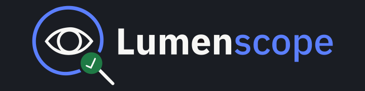

<div align="center">
  
</div>

[](LICENSE)
[](package.json)
[](package.json)
[](package.json)
[](package.json)

**Lumenscope** is a premium, developer-first, web-based accessibility audit instrument. Paste any public website URL, scan its DOM tree under a secure proxy environment, and generate a scored, detailed WCAG compliance assessment report with interactive visual overlays.

---

## 🔍 The Problem & The Solution

### The Problem
* **Accessibility Blindness**: 90%+ of website homepages fail basic Web Content Accessibility Guidelines (WCAG). Most developers are unaware of hidden programmatic accessibility barriers (such as missing alt texts, keyboard traps, and bad color contrast ratios).
* **Costly Audit Engines**: Industry-standard accessibility engines require launching heavy headless browser engines like Puppeteer, driving up server costs and deployment complexities.
* **Lack of Visual Guidance**: Standard CLI checkers output a text wall of error elements, making it difficult for designers and developers to immediately locate issues on the page.

### The Solution
* **Zero-Engine In-Browser Audits**: Lumenscope proxies target sites on a secure backend and renders them in a safe same-origin `srcdoc` iframe. The industry-standard `axe-core` library is run directly inside the browser against the live iframe DOM context, removing server CPU bottlenecks.
* **Interactive Highlights**: Discovered accessibility violations are overlaid directly on the rendered website page. Hovering/clicking a violation highlights the exact HTML element in real time.
* **Detailed PDF Exporter**: Section-wise PDF report generation featuring dynamic page-break logic, sequential numbering, and full visual compliance cards.

---

## 🎨 Logo Design Concept: "The Illuminating Lens"

The Lumenscope logo represents a precise diagnostic instrument:
* **The Icon**: A magnifying glass whose lens contains an eye outline, overlapping a checkmark badge.
  * **Magnifying Glass**: Represents testing, scanning, and programmatic audit analysis.
  * **Eye outline**: Focuses on visual accessibility and human-centric design.
  * **Pass Checkmark**: Reflects compliance verification and positive audit outcomes.
* **The Concept Rationale**: Unlike generic SaaS logos, it incorporates the metaphor of a **Movie Review / Preview (MR) lens with a light focus**. Just as film reviews shine a spotlight to provide honest, accurate information to the audience, the lens focuses light on the target website to illuminate hidden accessibility violations, giving developers exact, real-world data to improve the user experience.

---

## 🛠️ Technology Stack

### Client Workspace (React Frontend SPA)
* **Framework**: React 18.3.1
* **Build Tool**: Vite 8.0.9 (Rolldown Rust-bundler integration for ultra-fast builds)
* **Styling**: Tailwind CSS v4.2.2 (Modern CSS-native `@theme` configurations)
* **Accessibility Audit**: axe-core 4.11.4
* **Animation**: Motion 12.40.0 (`motion/react`)
* **Charts & Data**: Recharts 3.8.1
* **PDF Exporter**: html2pdf.js 0.14.0 (with explicit A4 page sizing and page-slicing logic)
* **Icons**: Lucide React 1.17.0
* **Router**: React Router v7.17.0

### Server Workspace (Express Proxy Backend)
* **Server Framework**: Express 4.21.0
* **CORS Policy**: cors 2.8.5
* **Security & Auth**: dotenv 16.4.5, googleapis (Gmail API OAuth2 delivery)
* **Abuse Protection**: express-rate-limit 8.5.2

---

## 📂 Project Folder Structure

```
Lumenscope/
├── .github/                ← GitHub Action Workflows
│   └── workflows/
│       ├── ci.yml
│       ├── deploy-client.yml
│       └── deploy-server.yml
├── client/                 ← React Frontend SPA
│   ├── public/             ← Static assets (Sitemap, Robots.txt, Favicons)
│   │   ├── robots.txt
│   │   └── sitemap.xml
│   ├── src/
│   │   ├── assets/         ← Icons, Logos & Branding SVG/PNGs
│   │   ├── components/     ← Common UI, Home, Contrast, and Results components
│   │   ├── hooks/          ← Custom hooks (useScan, useHighlight, useExport)
│   │   ├── lib/            ← Scan engine & utility functions
│   │   ├── pages/          ← Pages (HomePage, ResultsPage, ContrastCheckerPage, AboutPage)
│   │   ├── styles/         ← Tailwind CSS source styles
│   │   ├── types/          ← TypeScript interface definitions
│   │   └── main.tsx
│   ├── vite.config.ts
│   └── package.json
├── server/                 ← Express proxy backend
│   ├── src/
│   │   ├── middleware/     ← Security & rate limiting middleware
│   │   ├── routes/         ← Express routes (fetch router, contact mailer)
│   │   ├── utils/          ← Helper scripts (sanitizeHtml, oauth mailer)
│   │   └── config.js
│   ├── index.js
│   └── package.json
├── shared/                 ← Shared packages / typings
├── .editorconfig           ← Unified editor guidelines
├── .gitattributes          ← Line-ending normalization configurations
├── .gitignore              ← Untracked file rules
├── CHANGELOG.md            ← Version history log
├── CONTRIBUTING.md         ← Contribution guidelines
├── LICENSE                 ← MIT License
├── package.json            ← Workspace configuration metadata
└── README.md               ← Setup, installation, and architectural overview
```

---

## 🔌 API Documentation

### 1. HTML Fetch Proxy Endpoint
* **Path**: `/api/fetch`
* **Method**: `GET`
* **Description**: Pulls raw HTML from any public web URL, strips dangerous script elements for client-side sandboxing, and serves it back cross-origin-safe.
* **Parameters**:
  * `url` (query string): The fully qualified URL to scan (e.g. `https://example.com`).
* **Example Usage**:
  ```bash
  curl "http://localhost:3001/api/fetch?url=https://example.com"
  ```
* **Sample Response**:
  ```json
  {
    "html": "<!DOCTYPE html><html><head><base href=\"https://example.com/\"></head><body>...</body></html>"
  }
  ```

### 2. Contact Message API (OAuth2 Gmail SMTP)
* **Path**: `/api/contact`
* **Method**: `POST`
* **Description**: Receives user contact/message submissions and routes them securely via Gmail SMTP utilizing OAuth2.
* **Payload**:
  ```json
  {
    "name": "Loganathan G P",
    "email": "loganathan@example.com",
    "message": "Enquiry regarding accessibility dashboard integration."
  }
  ```
* **Sample Response**:
  ```json
  {
    "success": true,
    "message": "Message sent successfully"
  }
  ```

---

## 🎨 Brand Design Tokens

All colors verified programmatically to guarantee AAA contrast ratios for primary elements on paper backgrounds:

### Color Palette (Contrast Verified)
* **Paper Canvas Background (`--paper`)**: `#F7F7F5`
* **Ink Text & Headers (`--ink`)**: `#1A1D23` (15.74:1 AAA contrast)
* **Signal Brand Accent (`--signal-blue`)**: `#2D5BFF` (4.83:1 AA contrast)
* **Secondary Labels (`--minor-grey`)**: `#6B7280` (4.51:1 AA contrast)
* **Card Borders (`--border`)**: `#D9D9D6`

### Font Families
* **Interface Display/Headings**: `IBM Plex Sans` (700 Bold / 600 Semi-Bold)
* **Snipets, Code & Ratios**: `IBM Plex Mono` (400 Regular / 600 Semi-Bold)

---

## 🚀 Setup & Installation Guide

Follow these steps to clone, configure, and run the project locally.

### Prerequisites
* **Node.js**: `v20.19+` or `v22.12+`
* **NPM**: `v10+`

### 1. Clone the Repository
```bash
git clone https://github.com/logusivam/Lumenscope.git
cd Lumenscope/Lumenscope
```

### 2. Install Dependencies
Install dependencies using legacy-peer-deps to verify compatibility across React workspaces:
```bash
npm install --legacy-peer-deps
```

### 3. Environment Configurations
Configure backend and frontend environment files.

#### Client Configuration
Create `client/.env`:
```env
VITE_API_URL=http://localhost:3001
VITE_FRONTEND_URL=http://localhost:5173
```

#### Server Configuration
Create `server/.env`:
```env
PORT=3001
FRONTEND_URL=http://localhost:5173
GMAIL_USER=your-email@gmail.com
CLIENT_ID=your-google-client-id
CLIENT_SECRET=your-google-client-secret
REFRESH_TOKEN=your-google-oauth-refresh-token
```

### 4. Run Development Servers
Start both client and server development setups concurrently:
```bash
npm run dev
```
* **Frontend Application**: `http://localhost:5173`
* **Proxy Backend Server**: `http://localhost:3001`

### 5. Running Tests
Run the client unit/component test suite:
```bash
npm run test:client
```
Run the backend proxy tests:
```bash
npm run test:server
```

---

## 👥 Brand & Developer Attribution

* **Lead Developer**: [Loganathan G P](https://loganathan-portfolio.onrender.com)
* **Brand / Company**: **Logusivam Vision**